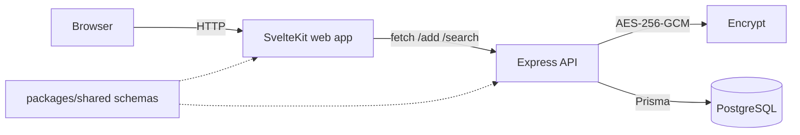
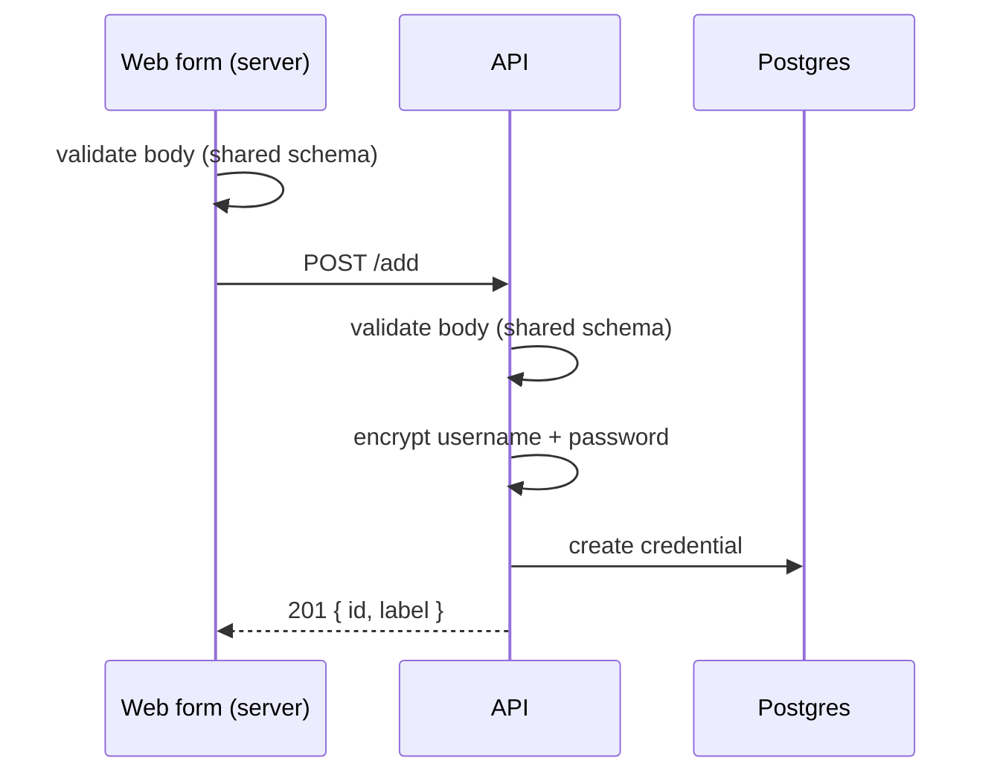
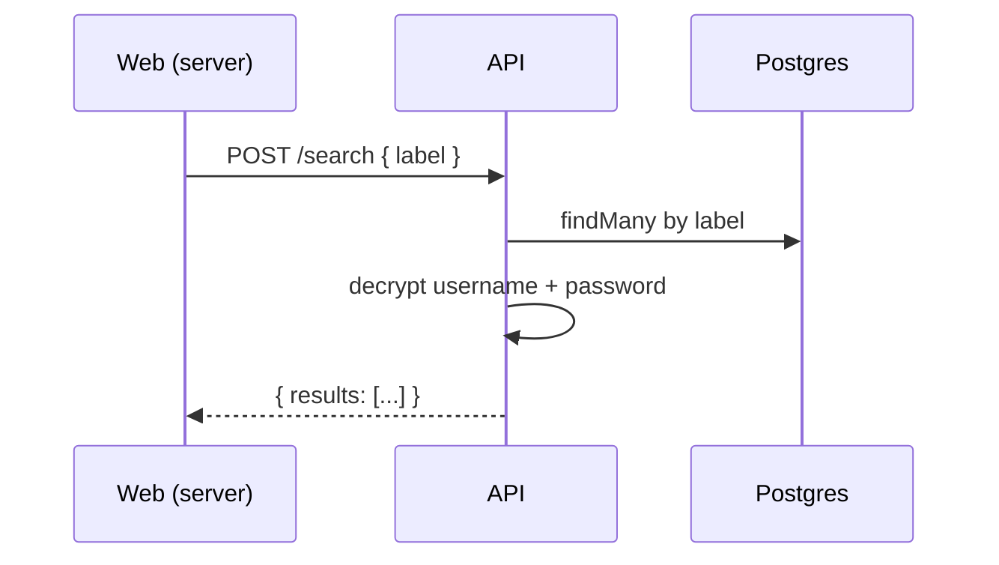

# Architecture

> See [README](./README.md) for setup and usage instructions.

## Overview

securepass is a full-stack password manager split across two apps and a few shared packages. The web app renders the UI and forwards requests to the API; the API owns validation, encryption, and persistence. The two never share business logic — only types and schemas, which live in `@packages/shared`.



Web is a pure HTTP client to the API today. It never talks to the database directly — the API is the single owner of secrets and encryption.

## Workspace layout

```
.
├── apps
│   ├── api               # Express API (compiled to build/)
│   └── web               # SvelteKit web app
├── packages
│   ├── db                # Prisma client + migrations
│   ├── shared            # zod schemas shared by web + api
│   ├── eslint-config     # shared lint config
│   └── prettier-config   # shared format config
├── docker-compose.yml    # production stack (db + api + web)
├── dockerfile            # multi-stage image (api / web targets)
├── turbo.json            # task graph
├── pnpm-workspace.yaml
└── package.json
```

## Packages

### `apps/web` — SvelteKit 5 UI

- Routes: `/`, `/add`, `/search`, `/about`.
- Server-side modules per route (`add.remote.ts`, `search.remote.ts`) validate the request body with `@packages/shared`, then `fetch` the API.
- Validates env on startup via `defineEnvVars` (`PUBLIC_API_URL` public, `DATABASE_URL` server-only).
- Builds to a Node production server via `@sveltejs/adapter-node`.

### `apps/api` — Express 5

- `main.ts` wires middleware (helmet, JSON, CORS) and handles graceful shutdown on `SIGTERM`/`SIGINT`.
- `env.ts` validates environment at startup with zod — it refuses to serve if config is wrong.
- Routes: `GET /health`, `POST /add`, `GET /show`, `POST /search`.
- `services/credential.ts` is the only place secrets are encrypted or decrypted.
- Compiled to plain Node ESM in `build/` via tsdown.

### `packages/db` — Prisma

- Prisma 7 with the `@prisma/adapter-pg` driver, client generated into `generated/prisma`.
- Exports a `prisma` singleton (for the API) and `createPrismaClient(url)` (for callers that manage their own lifecycle).
- Schema and migrations live here and are applied with `pnpm db:migrate` / `pnpm db:deploy`.

### `packages/shared` — schemas & types

- Single source of truth for request/response shapes (`add`, `search`) so web and API validate against the same contracts.

### `packages/eslint-config`, `packages/prettier-config`

- Shared developer tooling only; no runtime code.

## Data model

| Field                     | Type     | Notes                       |
| ------------------------- | -------- | --------------------------- |
| `id`                      | Int      | autoincrement PK            |
| `label`                   | String   | searchable, plaintext       |
| `encryptedUsername`       | String   | AES-256-GCM ciphertext blob |
| `encryptedPassword`       | String   | AES-256-GCM ciphertext blob |
| `createdAt` / `updatedAt` | DateTime | auto-maintained             |

Ciphertext is stored as JSON `{iv, tag, data}`. The key is `ENCRYPTION_KEY` (base64 of 32 bytes) and is only present in the API's environment — it is never written to the database. Changing it makes previously stored credentials unreadable.

## Request flow

**Add** (`POST /add`):



**Search** (`POST /search`):



## Task graph

Turbo coordinates workspace tasks. `build` and `dev` depend on `^db:generate`, so the Prisma client is generated before any app builds or runs.

| Command           | Purpose                        |
| ----------------- | ------------------------------ |
| `pnpm dev`        | Watch + hot-reload web and API |
| `pnpm build`      | Build all apps                 |
| `pnpm check`      | Typecheck + lint every package |
| `pnpm db:migrate` | Apply a dev migration          |
| `pnpm db:deploy`  | Apply migrations in production |

Husky + lint-staged enforce formatting and checks before each commit.

## Docker & deployment

- The root `dockerfile` is multi-stage: `base` → `api` and `web` targets. The database image is built from `packages/db/dockerfile` (Postgres 17).
- `docker-compose.yml` (root) runs the full **production** stack: `db` (`securepass`, volume-backed), `api` (:8000), `web` (:4173). Start it with `pnpm docker:start`.
- `packages/db/docker-compose.yml` runs the **development** database only (`securepass-dev`) via `pnpm db:start`.

## Environment variables

| App        | Variable         | Notes                                      |
| ---------- | ---------------- | ------------------------------------------ |
| `apps/api` | `PORT`           | HTTP port                                  |
|            | `CORS_ORIGIN`    | comma-separated allowed origins            |
|            | `DATABASE_URL`   | PostgreSQL connection string               |
|            | `ENCRYPTION_KEY` | base64 of 32 bytes; AES-256-GCM            |
| `apps/web` | `PUBLIC_API_URL` | browser-visible base URL of the API        |
|            | `DATABASE_URL`   | required, but currently unused (see notes) |

## Boundaries

| Scope               | Ownership                                 |
| ------------------- | ----------------------------------------- |
| `apps/web`          | UI, routing, HTTP client to the API       |
| `apps/api`          | HTTP, validation, encryption, persistence |
| `packages/db`       | Prisma client + migrations                |
| `packages/shared`   | Shared request/response contracts         |
| `packages/*-config` | Developer tooling                         |
| Root                | Orchestration, Docker, cross-app checks   |

## Notes

- `apps/web/src/lib/server/db.ts` and the web `DATABASE_URL` requirement exist but are not referenced — the web app currently talks to the API exclusively. They can be removed if the API remains the only DB consumer.
- `GET /show` returns stored credentials as raw encrypted blobs (no decryption), unlike `search` — a present inconsistency in the API.
